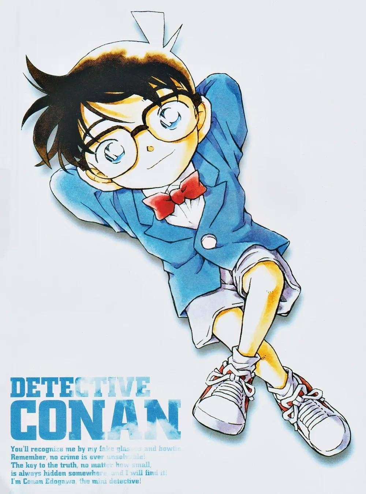
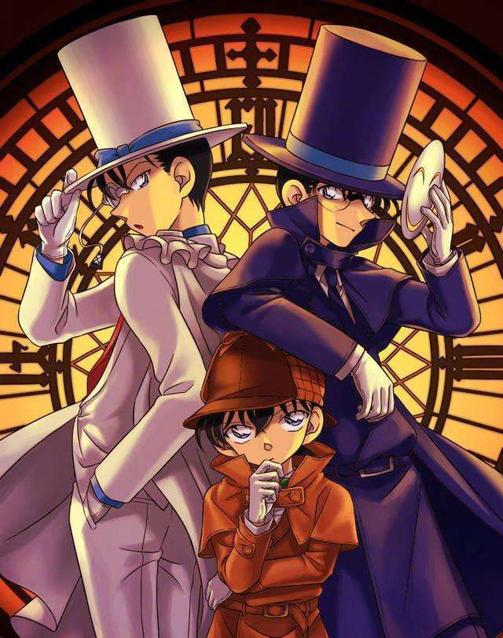

# 名侦探柯南 介绍

## 一、作品简介
《名侦探柯南》（名探偵コナン / Detective Conan）是日本漫画家**青山刚昌**创作的推理漫画，自 1994 年起在小学馆《周刊少年 Sunday》连载至今，单行本已逾 100 卷，堪称日本最长寿、最具影响力的推理作品之一。作品先后被改编为**电视动画、剧场版电影、游戏、舞台剧**等多种形式，风靡日本、畅销全球，缔造了跨越世代的「国民级」人气。

- **作者**：青山刚昌（1963 年生，鸟取县出身）
- **连载时间**：1994 年 1 月 5 日至今
- **出版社**：小学馆（《周刊少年 Sunday》）
- **动画制作**：TMS Entertainment（原东京电影新社）
- **电视动画首播**：1996 年 1 月 8 日

## 二、主角简介
- **江户川柯南**，本名**工藤新一**——高中生侦探，曾被誉为「平成年代的福尔摩斯」（如今在作中已更新为「令和的福尔摩斯」）。
- 故事开篇，他在追查黑衣组织时被灌下毒药 **APTX4869**，非但没死，身体反而缩小成了小学生的模样。
- 为隐藏身份、暗中追查组织，他化名「江户川柯南」——**江户川**取自日本推理之父江户川乱步，**柯南**取自英国推理大师柯南·道尔——并寄住在青梅竹马毛利兰家中。
- 他借毛利兰的父亲毛利小五郎之名破案：先用手表型麻醉枪让小五郎「沉睡」，再以变声领结模仿其声线，以「**沉睡的小五郎**」之名一次次揭露真相。
- 随身道具均出自邻居阿笠博士之手：**变声领结、追踪眼镜、脚力增强鞋、手表型麻醉枪、伸缩背带、少年侦探团徽章**等，件件堪称经典。

## 三、主要角色

### 主角阵营
- **工藤新一 / 江户川柯南**：本作主角，头脑冷静、观察入微，推理能力超群。
- **毛利兰**：新一的青梅竹马兼女友，空手道高手（关东大赛优胜级别），外表温柔、内心坚韧，曾多次险些识破柯南的真实身份。
- **毛利小五郎**：兰的父亲，私家侦探。看似糊涂好酒，实为前警察，关键时刻常有意外的惊人表现。
- **灰原哀**：本名**宫野志保**，组织前研究员（代号 Sherry），APTX4869 的研发者之一。姐姐宫野明美惨遭组织杀害后，她服药逃离组织，与柯南一样身体缩小。
- **阿笠博士**：新一的邻居，天才发明家，柯南高科技道具的幕后供给者。
- **少年侦探团**：由柯南、灰原哀、吉田步美、圆谷光彦、小岛元太组成的「儿童侦探团」。

### 关键配角与警方
- **服部平次**：关西的高中生侦探，新一惺惺相惜的挚友与对手，剑道高手。
- **远山和叶**：平次的青梅竹马。
- **怪盗基德**：月光下的魔术师，神出鬼没，与柯南多次交锋（实为姊妹作《魔术快斗》的主角黑羽快斗）。
- **目暮十三、高木涉、佐藤美和子**：警视厅搜查一课刑警，戏份吃重的黄金搭档。
- **赤井秀一**：FBI 王牌狙击手，曾潜入组织的传奇探员。
- **安室透（降谷零 / 波本）**：身兼三重身份的组织卧底，人气极高。
- **水无怜奈（本堂瑛海）**：CIA 派入组织的卧底。

### 黑衣组织（黑色组织）
- **琴酒（Gin）**：组织核心干部，冷酷果断，是柯南的宿敌。
- **伏特加（Vodka）**：琴酒的贴身手下。
- **贝尔摩德（Vermouth）**：神秘莫测的女性成员，人称「千面魔女」。
- **朗姆（RUM）**：组织二号人物，身份一度成谜。
- **乌丸莲耶**：组织首领，成员口中的「那位先生」。

## 四、剧情结构
本作采用「**单元式推理 + 主线推进**」的双线叙事，张弛有度：

1. **日常案件线**：以「密室」「不在场证明」「死亡讯息」等经典推理套路为主，多数案件一两话内收束，节奏明快。
2. **黑衣组织主线**：围绕 APTX4869、组织成员的真实身份、卧底与反卧底的暗战徐徐展开，节奏虽缓，悬念却始终紧绷。
3. **情感线**：工藤新一与毛利兰之间的羁绊，以及「新一归来」时假身份带来的无奈与试探，贯穿全作始终。

## 五、经典案件与剧情节点（选摘）
- **云霄飞车杀人事件**：全篇开章，也是新一被灌药缩小的命运起点。
- **钢琴奏鸣曲《月光》杀人事件**：被青山刚昌本人列为最难忘的案件之一。
- **危命的复活**：新一短暂恢复身体、与兰重逢的经典篇章。
- **满月之夜的双重推理**：组织线与推理线正面交织的重大转折。
- **红与黑的碰撞**：FBI 与组织大规模对抗的高潮战役。

## 六、经典台词
> 「真相永远只有一个！」（真実はいつもひとつ！）

> 「我叫江户川柯南，是个侦探。」

## 七、剧场版电影
自 1997 年《计时引爆摩天楼》起，剧场版**每年 4 月准时上映一部**，逐渐固化为「国民级」年度档期，票房屡创新高。代表作包括：

- 《计时引爆摩天楼》（1997）
- 《通往天国的倒计时》（2001）
- 《迷宫的十字路口》（2003）
- 《漆黑的追踪者》（2009）
- 《纯黑的噩梦》（2016）
- 《零的执行人》（2018）
- 《绀青之拳》（2019）
- 《万圣节的新娘》（2022）
- 《黑铁的鱼影》（2023，系列首部票房破百亿日元之作）
- 《100 万美元的五棱星》（2024）

## 八、主题曲与音乐
- 电视动画诞生了大量传唱至今的主题曲，如 **《謎》（小松未步）、《转动命运之轮》（ZARD）、《唯一的愿望》（B'z）** 等。
- 作曲家**大野克夫**笔下的标志性 BGM 深入人心，与片头「追踪镜头」「门关上的那一刻」等经典桥段一道，早已成为作品的标志性符号。

## 九、作品特色与影响力
- **推理启蒙**：大量化用福尔摩斯、江户川乱步等经典推理元素，堪称无数读者的「推理入门第一课」。
- **长寿与稳定**：漫画连载逾 30 年、动画逾千集，依旧热度不减，堪称罕见的长寿 IP。
- **文化符号**：「沉睡的小五郎」「真相只有一个」等早已跳出作品本身，成为流行文化中的经典梗。
- **社会影响**：带动了故乡鸟取县「柯南小镇」（青山刚昌故乡馆）等文旅热潮，让虚构的侦探照进现实。

## 十、一句话总结
> 一个被迫变小的名侦探，以智慧拨开重重迷雾，在与黑暗组织的漫长博弈中，追寻真相，也追寻归途。

